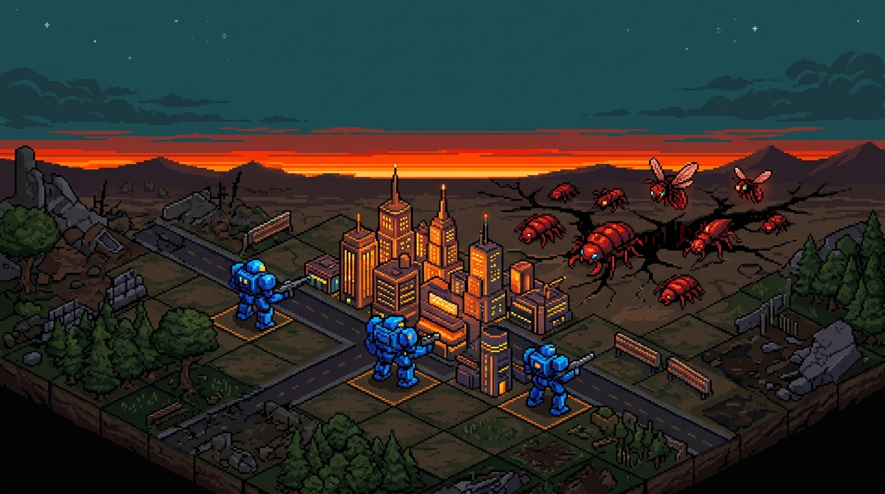
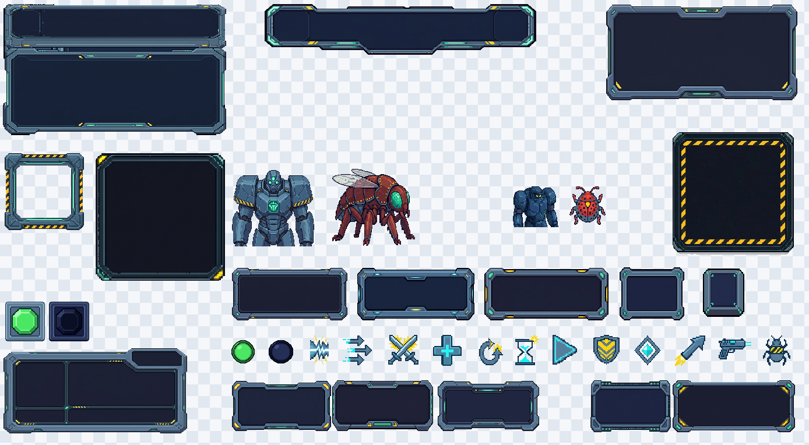
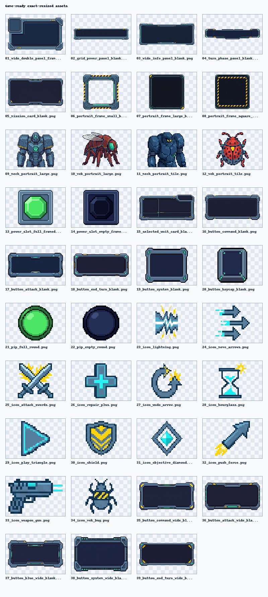

# STG Template Meowa

A small but complete grid tactics game template built in Godot 4.6, with the game art, UI art, music, and sound effects produced through Meowa.

This repository is meant to show how Meowa can be used to build a playable strategy tactics game from generated assets. It can also be used as a starting point for turn-based grid combat games with isometric boards, telegraphed enemy attacks, displacement skills, and between-mission upgrades.

[English](#english) | [中文](#中文)

<p align="center">
  
</p>

<p align="center">
  
</p>

<p align="center">
  
</p>

## English

### What this is

This is a compact tactical strategy template:

1. Defend buildings on an 8x8 isometric battlefield.
2. Control a fixed squad of three mechs.
3. Read enemy telegraphs before they attack.
4. Push, pull, block, and redirect enemies to protect the grid.
5. Clear seven missions, buying upgrades between battles.

The project is intentionally small enough to study, but complete enough to use as a real template: it has deterministic combat logic, view-layer animation, generated pixel assets, audio, tests, and Web export tooling.

### Game systems

- 8x8 isometric tactical board.
- Three playable mech roles: melee, artillery, and science/control.
- Enemy attack telegraphs resolved on the following enemy phase.
- Push and pull mechanics with water, chasm, mountain, building, unit, and map-edge collision rules.
- Attack preview computed from a cloned battle state.
- Undo support from a turn-start snapshot.
- Seven-mission run structure with a shop between missions.
- Grid power carryover across missions.
- Godot Web export with a fixed-size pixel canvas shell.

### Built with Meowa

The project uses generated assets as first-class production files, not placeholders.

| Asset area | In this repo | Meowa workflow |
| --- | --- | --- |
| Mech and enemy sprites | `assets/sprites/` | Pixel sprite generation |
| Terrain and buildings | `assets/tiles/` | Isometric tile generation |
| HUD panels and icons | `assets/ui/generated_hud_pixel_meowa/` | Pixel UI generation and slicing |
| Title art | `assets/ui/title_bg.png` | Image generation |
| Music and sound effects | `assets/audio/` | Music and SFX generation |

Local raw generation logs and intermediate outputs are intentionally ignored:

- `outputs/`
- `.agents/skills/game-assets/.meow_art/`
- `.env`

To regenerate assets, set a Meowa API key locally:

```bash
echo 'MEOWART_API_KEY=<your-key>' > .env
python3 .agents/skills/game-assets/meowart_api.py credits-balance
```

### How to run

Open the project in Godot 4.6 and press Play, or run it from the command line:

```bash
godot --path .
```

If your Godot binary is not named `godot`, set `GODOT_BIN` for scripts:

```bash
export GODOT_BIN=/path/to/godot
```

### Controls

| Action | Input |
| --- | --- |
| Select unit / tile | Left click |
| Pan board | Left-drag |
| Move mode | `Q` |
| Attack mode | `W` |
| Repair | `E` |
| Undo turn | `Z` |
| End turn | `X` |
| Toggle grid overlay | `G` |

### Tests

Run the Godot test suite:

```bash
"${GODOT_BIN:-godot}" --headless --path . -s addons/gut/gut_cmdln.gd -gdir=res://tests -gexit
```

Run the Web export tooling checks:

```bash
python3 tests/test_web_export_tooling.py
```

### Web export

Build the Web package:

```bash
GODOT_BIN="${GODOT_BIN:-godot}" ./tools/export_web.sh
```

Serve it locally:

```bash
./tools/serve_web.sh
```

Then open:

```text
http://127.0.0.1:58244
```

The Web shell keeps the Godot canvas backing size fixed and uses pixelated viewport scaling, so pixel art remains integer-scaled inside Godot.

### Project layout

```text
project.godot                     Godot project settings
main.tscn                         Main scene
src/core/                         Deterministic battle and run logic
src/data/                         Unit, weapon, and mission definitions
src/view/                         Godot view layer, screens, HUD, board rendering
assets/sprites/                   Generated mech and enemy sprites
assets/tiles/                     Generated terrain and building tiles
assets/ui/                        Generated title and HUD assets
assets/audio/                     Generated BGM and SFX
tests/                            GUT tests and Web tooling checks
tools/                            Export, serve, autoplay, and debug helpers
web/pixel_viewport_shell.html     Fixed-canvas Web shell
```

### Template notes

Use this repository as a base if you want:

- a small Godot tactical RPG / strategy battle prototype;
- deterministic board-game-style combat rules;
- a clean split between simulation logic and presentation;
- a reference for integrating Meowa-generated game assets into a playable project;
- a Web-exportable pixel-art game shell.

## 中文

### 这是什么

这是一个用 Godot 4.6 制作的小型战棋游戏模板。项目中的游戏美术、UI 美术、音乐和音效都通过 Meowa 生成，并被整理成可直接运行的 Godot 工程。

这个仓库的目标是说明：如何用 Meowa 生成的资产做出一个可玩的战棋游戏。同时，它也可以作为回合制网格战斗游戏的起点，用来扩展等距棋盘、敌方预警、推拉位移、任务流程和局外升级系统。

核心玩法流程：

1. 在 8x8 等距棋盘上保护建筑。
2. 操控 3 台固定定位的机甲。
3. 读取敌人下一回合的攻击预警。
4. 通过推动、拉拽、阻挡和转向敌人来保护电网。
5. 连续完成 7 个任务，并在任务之间购买升级。

项目规模刻意保持紧凑，但不是空壳 demo：它包含确定性的战斗核心、视图层动画、生成式像素资产、音频、测试和 Web 导出工具。

### 游戏系统

- 8x8 等距战棋棋盘。
- 3 种机甲定位：近战、炮击、科学控制。
- 敌人会先显示攻击预警，并在下一次敌方阶段结算。
- 推拉系统支持水面、裂隙、山体、建筑、单位和地图边缘碰撞规则。
- 攻击预览通过克隆战斗状态计算，不会污染真实状态。
- 支持基于回合开始快照的撤销。
- 7 个连续任务，中间穿插升级商店。
- 电网生命值会跨任务继承。
- 支持 Godot Web 导出，并使用固定像素画布的 Web shell。

### 使用 Meowa 生成的内容

这个项目把生成资产作为正式资源使用，而不是临时占位图。

| 资产类型 | 仓库位置 | Meowa 生成方向 |
| --- | --- | --- |
| 机甲和敌人精灵 | `assets/sprites/` | 像素角色生成 |
| 地形和建筑 | `assets/tiles/` | 等距瓦片生成 |
| HUD 面板和图标 | `assets/ui/generated_hud_pixel_meowa/` | 像素 UI 生成和切图 |
| 标题图 | `assets/ui/title_bg.png` | 图像生成 |
| 音乐和音效 | `assets/audio/` | 音乐和 SFX 生成 |

本地原始生成记录和中间产物不会提交到仓库：

- `outputs/`
- `.agents/skills/game-assets/.meow_art/`
- `.env`

如果需要重新生成资产，可以在本地配置 Meowa API key：

```bash
echo 'MEOWART_API_KEY=<your-key>' > .env
python3 .agents/skills/game-assets/meowart_api.py credits-balance
```

### 如何运行

用 Godot 4.6 打开项目并点击 Play，或使用命令行：

```bash
godot --path .
```

如果你的 Godot 可执行文件不是 `godot`，可以给脚本设置 `GODOT_BIN`：

```bash
export GODOT_BIN=/path/to/godot
```

### 操作

| 动作 | 输入 |
| --- | --- |
| 选择单位 / 格子 | 鼠标左键 |
| 拖动画面 | 鼠标左键拖拽 |
| 移动模式 | `Q` |
| 攻击模式 | `W` |
| 修理 | `E` |
| 撤销当前回合 | `Z` |
| 结束回合 | `X` |
| 显示 / 隐藏网格 | `G` |

### 测试

运行 Godot 测试：

```bash
"${GODOT_BIN:-godot}" --headless --path . -s addons/gut/gut_cmdln.gd -gdir=res://tests -gexit
```

运行 Web 导出工具检查：

```bash
python3 tests/test_web_export_tooling.py
```

### Web 导出

构建 Web 包：

```bash
GODOT_BIN="${GODOT_BIN:-godot}" ./tools/export_web.sh
```

本地启动预览服务：

```bash
./tools/serve_web.sh
```

然后打开：

```text
http://127.0.0.1:58244
```

Web shell 会保持 Godot canvas 的实际尺寸固定，只在浏览器视口层做像素化缩放，避免破坏像素美术的整数缩放规则。

### 项目结构

```text
project.godot                     Godot 项目配置
main.tscn                         主场景
src/core/                         确定性的战斗和流程逻辑
src/data/                         单位、武器和任务定义
src/view/                         Godot 视图层、界面、HUD、棋盘渲染
assets/sprites/                   生成的机甲和敌人精灵
assets/tiles/                     生成的地形和建筑瓦片
assets/ui/                        生成的标题图和 HUD 资源
assets/audio/                     生成的 BGM 和音效
tests/                            GUT 测试和 Web 工具检查
tools/                            导出、服务、自动游玩和调试工具
web/pixel_viewport_shell.html     固定画布的 Web shell
```

### 作为模板使用

这个仓库适合作为以下项目的起点：

- 小型 Godot 战棋 / 策略战斗原型；
- 确定性、棋盘式的战斗规则系统；
- 战斗模拟逻辑和表现层分离的项目结构；
- 将 Meowa 生成的游戏资产整理进可玩工程的参考；
- 可导出到 Web 的像素风游戏模板。
